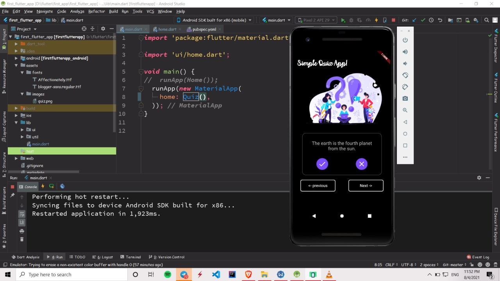
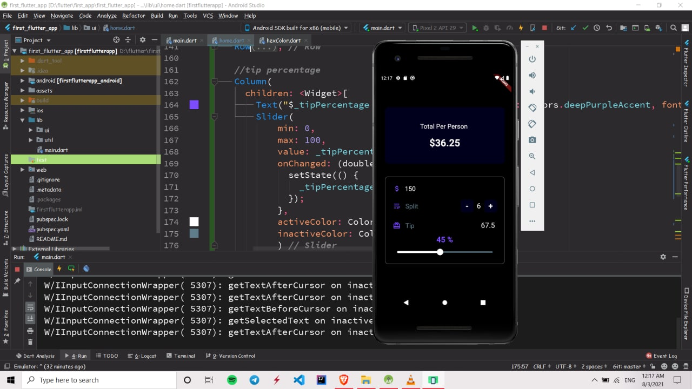
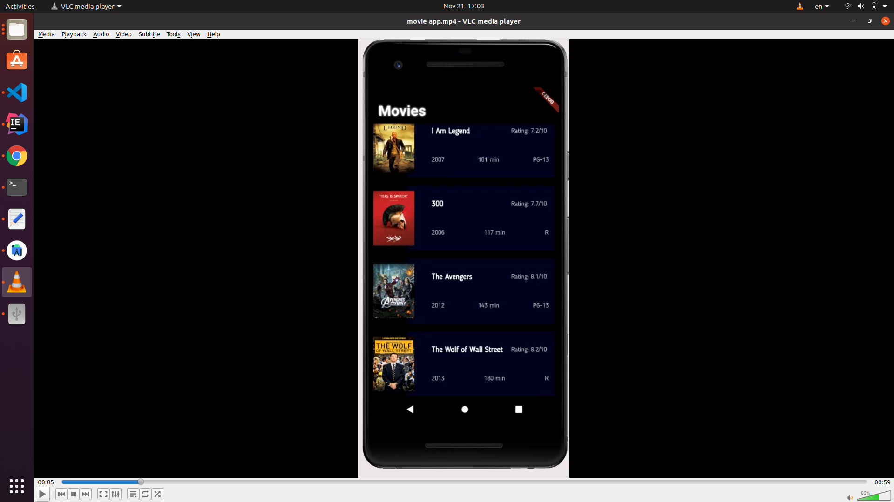
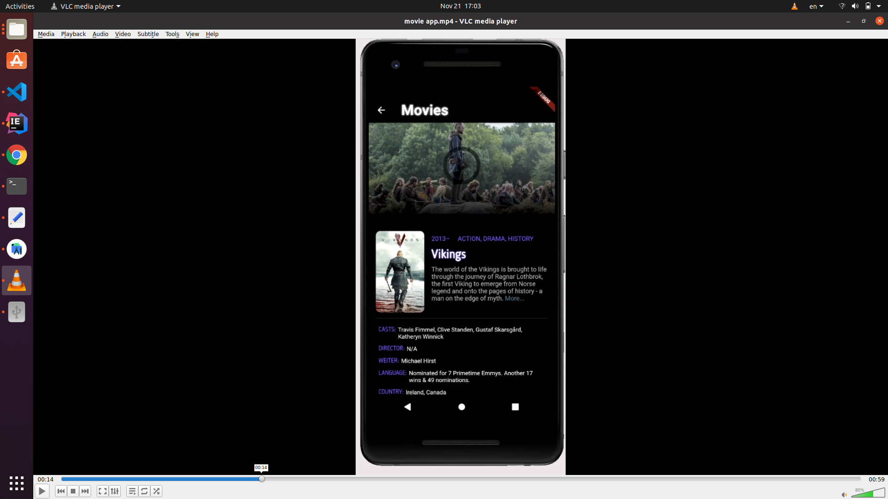
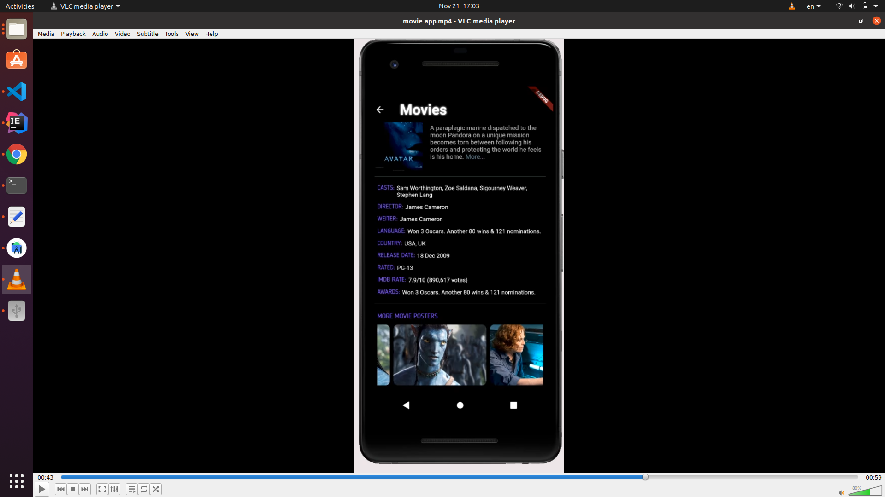

<!-- PROJECT LOGO -->
 

  

  <h3 align="center">My Flutter Practice Projects</h3>

<!-- TABLE OF CONTENTS -->

  
Contents of This Project

  <ol>
    <li>
      <a href="#about-the-project">About The Project</a>
      <ul>
        <li><a href="#built-with">Built With</a></li>
      </ul>
    </li>
    <li>
      <a href="#getting-started">Getting Started</a>
    </li>
    <li><a href="#project-demo">Demo</a></li>
  </ol>

<!-- ABOUT THE PROJECT -->
## About The Project

  
  
 
    This is the first project i made with flutter. the five apps in this projects helped me learn flutter.
    A Udemy Course by Paulo was my guide.
  

  
### Built With
* [Dart](https://dart.dev/)
* [Flutter](https://flutter.dev/)

## Getting Started

This project is a starting point for a Flutter application.

to run a flutter application you have to install android studio and flutter plugins. then you should provide a simulator (use in-app simulators or your own device). then click on run (available in android studio) and see the application on your simulator.

A few resources to get you started if this is your first Flutter project:

- [Lab: Write your first Flutter app](https://flutter.dev/docs/get-started/codelab)
- [Cookbook: Useful Flutter samples](https://flutter.dev/docs/cookbook)
- [install flutter guide](https://www.tutorialspoint.com/flutter/flutter_installation.htm#:~:text=Open%20Android%20Studio.,to%20install%20the%20Dart%20plugin.)

For help getting started with Flutter, view our
[online documentation](https://flutter.dev/docs), which offers tutorials,
samples, guidance on mobile development, and a full API reference.

## Project Demo

